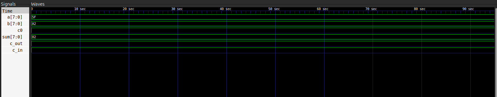

In the first lab, we implemented half adder, full adder and bit adder, by the end of which we were asked to implement a 8-bit adder and an ALU.

### 8-bit Adder
I have implemented a 8-bit adder by chaining two 4-bit adders, where the carry out of the lower nibble is passed as the carry in of the upper nibble.
The timing diagram for my 8-bit adder is:

### ALU
I have implemented these following operations in the 8-bit ALU:

| ALU Operation | `sel` (Binary) | `sel` (Hex) |   Operands   |
| ------------- | :------------: | :---------: | :----------: |
| ADD           |      `000`     |    `0x0`    | 2 (`a`, `b`) |
| SUBTRACT      |      `001`     |    `0x1`    | 2 (`a`, `b`) |
| AND           |      `010`     |    `0x2`    | 2 (`a`, `b`) |
| OR            |      `011`     |    `0x3`    | 2 (`a`, `b`) |
| XOR           |      `100`     |    `0x4`    | 2 (`a`, `b`) |
| COMPLEMENT    |      `101`     |    `0x5`    |    1 (`a`)   |
| NAND          |      `110`     |    `0x6`    | 2 (`a`, `b`) |
| NOR           |      `111`     |    `0x7`    | 2 (`a`, `b`) |

I have reused my 8-bit adder for the add and subtract operations, where subtraction is done by inverting `b` and setting the carry in to `1`, and the rest of the operations are simple bitwise assigns selected through an 8x1 mux.
The timing diagram of ALU is:
